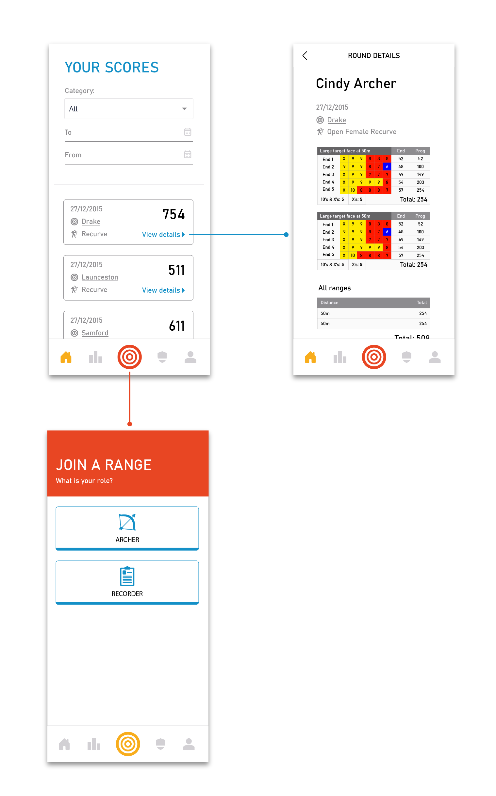
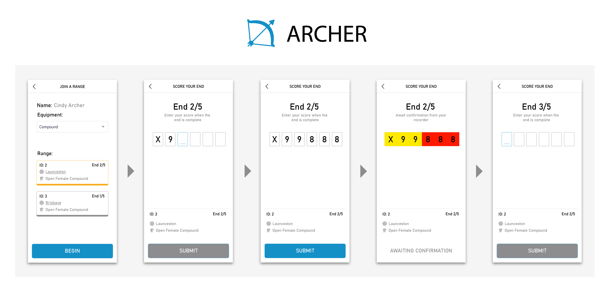

# ArrowMate - Archery Victoria Application Repository for COS20031 🏹

> [!NOTE]
> This repository exists to display the source code of the program, as well as a demonstration of detailed commit messages in a team setting.
> The application itself was run on a Swinburne-provided server which is no longer accessible.

ArrowMate is a mobile-first web application that helps Victorian archers join rounds, record scores, and track personal-best results.
It runs entirely in the browser as a single-page app (SPA) and communicates with the Swinburne-provided Feenix MariaDB with PHP.

## Adobe Sketches

